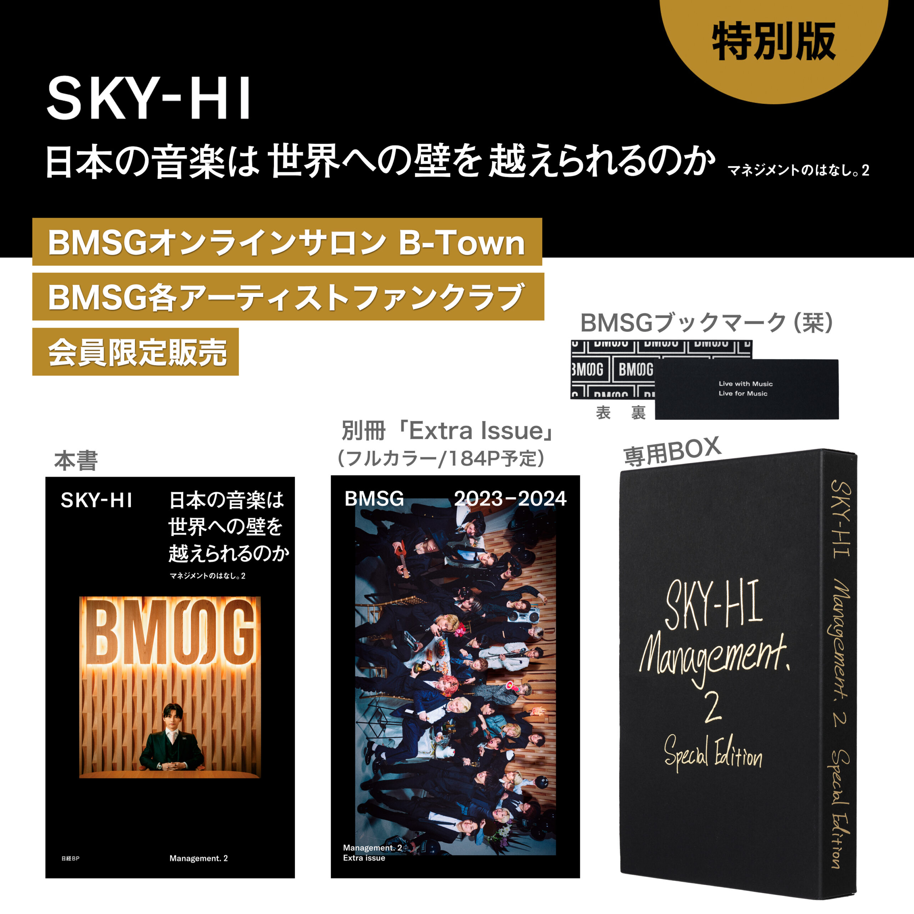

# SKYHI：日本音乐能否跨过走向世界的墙
# 管理的故事-2 （增刊）

- [amazon.co.jp 日亚购买](https://www.amazon.co.jp/%E6%97%A5%E6%9C%AC%E3%81%AE%E9%9F%B3%E6%A5%BD%E3%81%AF%E4%B8%96%E7%95%8C%E3%81%B8%E3%81%AE%E5%A3%81%E3%82%92%E8%B6%8A%E3%81%88%E3%82%89%E3%82%8C%E3%82%8B%E3%81%AE%E3%81%8B-%E3%83%9E%E3%83%8D%E3%82%B8%E3%83%A1%E3%83%B3%E3%83%88%E3%81%AE%E3%81%AF%E3%81%AA%E3%81%97%E3%80%822-SKY-HI/dp/4296206613)

    

# 目录

## 谈论BMSG

1. [Novel Core](./01_TalkAboutBMSG/01_NovelCore.md)
2. [Alie The Shota](./01_TalkAboutBMSG/02_AlieTheShota.md)
3. [edhiii boi](./01_TalkAboutBMSG/03_EdhiiiBoi.md)
4. [Reiko](./01_TalkAboutBMSG/04_Reiko.md)
5. [SOTA](./01_TalkAboutBMSG/05_SOTA.md)
6. [SHUNTO](./01_TalkAboutBMSG/06_SHUNTO.md)
7. [MANATO](./01_TalkAboutBMSG/07_MANATO.md)
8. [RYUHEI](./01_TalkAboutBMSG/08_RYUHEI.md)
9. [JUNON](./01_TalkAboutBMSG/09_JUNON.md)
10. [RYOKI](./01_TalkAboutBMSG/10_RYOKI.md)
11. [LEO](./01_TalkAboutBMSG/11_LEO.md)
12. [KAIRYU](./01_TalkAboutBMSG/12_KAIRYU.md)
13. [NAOYA](./01_TalkAboutBMSG/13_NAOYA.md)
14. [RAN](./01_TalkAboutBMSG/14_RAN.md)
15. [SEITO](./01_TalkAboutBMSG/15_SEITO.md)
16. [RYUKI](./01_TalkAboutBMSG/16_RYUKI.md)
17. [TAKUTO](./01_TalkAboutBMSG/17_TAKUTO.md)
18. [HAYATO](./01_TalkAboutBMSG/18_HAYATO.md)
19. [EIKI](./01_TalkAboutBMSG/19_EIKI.md)
20. [RUI](./01_TalkAboutBMSG/20_RUI.md)
21. [TAIKI](./01_TalkAboutBMSG/21_TAIKI.md)
22. [KANON](./01_TalkAboutBMSG/22_KANON.md)
23. [Trainee](./01_TalkAboutBMSG/23_Trainee.md)

## 往期采访

### Novel Core
- [Novel Core](./02_Interview/01_NovelCore/01_NovelCore.md)

### BE:FIRST
- [成员采访](./02_Interview/02_BEFIRST/01_BefirstMemberInterview.md)
- [团体采访](./02_Interview/02_BEFIRST/02_BefirstGroupInterview.md)
- [SKY-HI谈论BE:FIRST](./02_Interview/02_BEFIRST/03_SkyHiInterviewAboutBefirst.md)

### MAZZEL
- [成员采访](./02_Interview/03_MAZZEL/01_MazzelMemberInterview.md)
- [团体采访](./02_Interview/03_MAZZEL/02_MazzelGroupInterview.md)
- [SKY-HI谈论MAZZEL](./02_Interview/03_MAZZEL/03_SkyhiInterviewAboutMazzel.md)

    
- [编年史](./03_Chronicle/01_Chronicle.md)
- [编辑后记](./04_EditorsNote/04_EditorsNote.md)

